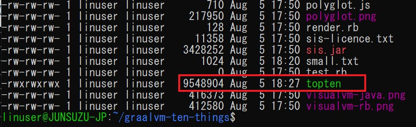

# Oracle GraalVM Enterprise ハンズオン演習 (Basic編)
_Wednesday, 9 December 2020_

## ＜目的と対象＞：
このハンズオン演習は、次世代Polyglot(多言語対応）環境であるOracle GraalVM Enterprise版の導入、操作手順を演習形式で学ぶためのガイドです。この演習を通じて以下の項目をマスターすることを目的としています。  
* GraalVMをPC環境への導入
* 新しいJITコンパイラー上でJavaクラスの実行
* 新しいAOTコンパイラー上でNative Imageの生成と実行
* Polyglot（多言語）プログラミングと実行  

このハンズオン演習の対象はJava基礎知識を有することが望ましいが、必須ではありません。

## ＜内容＞:

* **[演習 1: 前提環境／事前準備](#演習-1-前提環境事前準備)**
* **[演習 2: GraalVM Enterpriseのインストール](#演習-2-GraalVM-Enterprise-Editionのインストール)**
   * [2.1: GraalVM EE20.1.0のダウンロード](#21-GraalVM-EE2010のダウンロード)
   * [2.2: GraalVM Coreパッケージのインストール](#22-GraalVM-Coreパッケージのインストール)
   * [2.3: Native Imageのインストール](#23-Native-Imageのインストール)
   * [2.4: R言語コンポーネントのインストール](#24-R言語コンポーネントのインストール)

* **[演習 3: High-performance JIT コンパイラー](#演習-3-High-performance-JIT-コンパイラー)**
* **[演習 4: Native Imageの生成と実行](#演習-4-Native-Imageの生成と実行)**
* **[演習 5: Polyglotプログラミングと実行](#演習-5-Polyglotプログラミングと実行)**
<br/>
<br/>

# 演習 1: 前提環境／事前準備

本ワークショップを実施するための前提環境および事前準備作業を以下に記述します。Workshop当日は基本的に参加者に事前準備なされた環境のもとでハンズオン演習を実施して頂きます。

※ただし、ハンズオン演習部分を省きたい場合方は、GraalVMに関するプレゼンやDemoをご覧になりながら受講のみして頂くことも可能です。


  * 本ワークショップはLinux環境（WindowsマシーンのWSL環境を含む）を前提に進みます。（MacおよびWindows自体はGraalVMをサポートしますが、本ワークショップではUbuntu20.04の環境で実施、検証されたものです。
  * GitとCurlを事前にインストールしておいてください。
  * Githubリポジトリーからダウンロードすることがあるので、インターネットに繋がる状態が必要です。
  * 
<br/>

# 演習 2: GraalVM Enterprise Editionのインストール

以下はGraalVM Enterprise Edition 20.1.0 for JDK 8をインストール手順となります。

# 2.1: GraalVM EE20.1.0のダウンロード
(1) [OTN - Oracle Technology Network](https://www.oracle.com/downloads/graalvm-downloads.html)　からGraalVM Enterprise Editionをダウンロードします。下図のように"GraalVM Enterprise Edition 20 Current Release" タブを選択します。

   

<br/>

(2)“Release Version 20.1.0, Java Version 8, Linux”を選択します。 MacOSを使用している場合macOSを選択してください。現時点でWindows版ではLinuxとMacOSに比べてGraalVMのフィーチャーが少ないので、この演習ではWindows版を選択しません。

  

<br/>

(3)OSを選択後、以下のコンポーネントをダウンロードします。必須コンポーネントはこの演習に必要です。その他のオプショナルコンポーネントは演習では使いませんが、今後GraalVMの多くの機能を試したい場合はダウンロードしておいてください。
*	Oracle GraalVM Enterprise Edition Core（必須）
*	Oracle GraalVM Enterprise Edition Native Image（必須）
* Ideal Graph Visualizer（オプショナル）
*	GraalVM LLVM Toolchain Plugin（オプショナル）
*	Oracle GraalVM Enterprise Edition Ruby Language Plugin（オプショナル）
* GraalVM Enterprise Edition Python Language Plugin（オプショナル）
*	Oracle GraalVM Enterprise Edition WebAssembly（オプショナル）
* GraalVM R Language Plugin (必須）   
※R Pluginは直接ダウンロードできず、GraalVMのインストール・ユーティリティー(guコマンド)を使用してインストールします。)

  

上記コンポーネントをダウンロードするためには、OTNにログインする必要があります。OTNアカウントをお持ちでない方は以下のログイン画面から作成してください。


  

<br/>

コンポーネントをダウンロードした後、Linuxファイルシステム上に下記のようなモジュール一覧が表示されます：
* graalvm-ee-java8-linux-amd64-20.1.0.tar.gz(必須)
* idealgraphvisualizer-20.1.0-all.zip
* llvm-toolchain-installable-java8-linux-amd64-20.1.0.jar
*  native-image-installable-svm-svmee-java8-linux-amd64-20.1.0.jar(必須)
*  python-installable-svm-svmee-java8-linux-amd64-20.1.0.jar
*  namedruby-installable-svm-svmee-java8-linux-amd64-20.1.0.jar
* wasm-installable-svm-svmee-java8-linux-amd64-20.1.0.jar

 

<br/>

# 2.2: GraalVM Coreパッケージのインストール

(1)各モジュールをダウンロードした後、ダウンロード先のディレクトリーにて以下のコマンドを実行し、Coreパッケージを解凍します。
  >```sh
  >tar -zxf graalvm-ee-java8-linux-amd64-20.1.0.tar.gz
  >```
<br/>
上記コマンドの実行により”graalvm-ee-java8-20.1.0”というフォルダーが作成されます。
    


<br/>
フォルダーを任意のディレクトリーに移動します。そのディレクトリー配下がGraalVMのインストール先(Java Home)となります。下記の例ではフォルダーを/optの配下に移動する例です：

  >```sh
  >sudo mv graalvm-ee-java8-20.1.0 /opt/.
  >```

これにより、GraalVMのインストール・ディレクトリー（Java Home)は/opt/graalvm-ee-java8-20.1.0になります。

<br/>

(2)インストールしたGraalVMのパスを通すためには、以下のコマンドを実行します。

bashの場合
  >```sh
  >vi ~/.bashrc
  >```
zshの場合
  >```sh
  >vi ~/.zshrc
  >```


以下の行を ~/.zshrc もしくは ~/.bashrc に追加します。
  >```sh
  >export GRAALVM_HOME=/opt/graalvm-ee-java8-20.1.0
  >export PATH=$GRAALVM_HOME/bin:$PATH
  >export JAVA_HOME=$GRAALVM_HOME
  >```

ファイルを修正後、以下のコマンドで実行します。

bashの場合
  >```sh
  >source ~/.bashrc
  >```
zshの場合
  >```sh
  >source ~/.zshrc
  >```

以上でGraalVM Coreパッケージのインストールが完了しました。確認するため以下のjavaコマンドを実行します。
  >```sh
  >java –version
  >```

<br/>
以下の出力結果を確認できれば、GraalVM 20.1.0 Java8が正常にインストールされたことになります。

  >```sh
  >Java(TM) SE Runtime Environment (build 1.8.0_251-b08)
  >Java HotSpot(TM) 64-Bit Server VM GraalVM EE 20.1.0 (build 25.251-b08-jvmci-20.1-b02, mixed mode)
  >```
<br/>

# 2.3: Native Imageのインストール

(1)　Native ImageをインストールするのにGraalVM Utility(gu)を使用します。モジュールのダウンロード先にて下記コマンドを実行します。
  >```sh
  >gu install -L native-image-installable-svm-svmee-java8-darwin-amd64-20.1.0.jar
  >```

(2) Native Image依存ライブラリーのインストール

Native Imageの生成と実行は、以下３つのライブラリーが必要です。  
* glibc-devel: 標準 C ライブラリを使用した開発に必要なファイル
* zlib-devel: zip や gzip に使われている圧縮アルゴリズムをライブラリ化したもの
* gcc: C/C++など複数言語のコンパイラー集  

OSによりインストール・コマンドは異なります：  

Ubuntu
  >```sh
  >sudo apt-get install build-essential libz-dev zlib1g-dev
  >```

Oracle Linux
  >```sh
  >sudo yum install gcc glibc-devel zlib-devel
  >```
その他Linux
  >```sh
  >sudo dnf install gcc glibc-devel zlib-devel libstdc++-static
  >```
MacOS
  >```sh
  >xcode-select --install
  >
<br/>

# 2.4: R言語コンポーネントのインストール

(1)R言語コンポーネントのインストール  
以下のコマンドを実行し、必要なモジュールを自動的にgithubよりダウンロードされます。
  >```sh
  >gu install R
  >```

(2)R言語ソースのコンフィグ  

以下のコマンドでR言語ソースのコンフィグ作業を実施します。
  >```sh
  >/opt/graalvm-ee-java8-20.1.0/jre/languages/R/bin/configure_fastr
  >```

以下の出力結果を確認します。

 
    The basic configuration of FastR was successfull.

    Note: if you intend to install R packages you may need additional dependencies.
    The following packages should cover depenedencies of the most commonly used R packages:
    On Debian based systems: apt-get install build-essential gfortran libxml2 libc++-dev
    On Oracle Linux: yum groupinstall 'Development Tools' && yum install gcc-gfortran

    Default personal library directory (/home/mluther/R/x86_64-pc-linux-gnu-library/fastr-20.1.0-3.6) does exist. Do you wish to create it? (Yy/Nn) y
    Creating personal library directory: /home/mluther/R/x86_64-pc-linux-gnu-library/fastr-20.1.0-3.6
    DONE

<br/>
インストール完了後、以下のguコマンドでインストールされたモジュールを確認します：

  >```sh
  >gu list
  >```


<br/>
<br/>
お疲れ様でした！以上の作業で演習に必要な環境設定がすべて完了しました。以下のタスクを実施しました。

1.	GraalVM EE20.1.0のCoreパッケージのインストールおよびクラスパスの設定
2. Native Imageおよび依存ライブラリーのインストール
3. R言語のインストールとソースのコンフィグ  

<br/>
<br/>

# 演習 3: High-performance JIT コンパイラー

以下の演習は「Top 10 Things To Do With GraalVM」 の内容を使用します。  
https://medium.com/graalvm/graalvm-ten-things-12d9111f307d

(1)上記内容を使用するため、Githubよりソースをダウンロードします。以下のコマンドを実行します。

  >```sh
  >git clone https://github.com/marthenlt/native-image-workshop.git
  >```

(2)ダウンロードしたディレクトリーに移動します。

  >```sh
  >cd graalvm-ten-things
  >```

(3)以下のコマンドを実行し、large.txtファイルを作成します。この作業は時間がかかります。

  >```sh
  >make large.txt
  >```

(4)large.txtファイルが作成されたことをlsコマンドで確認します。サイズが150MBであることを確認してください。


(5)TopTen.javaはlarge.txtの中から単語を集計し、上位トップテンの単語一覧を出力するJavaプログラムです。このプログラムはStream Java APIを使用し、すべての単語をソート、カウントします。 

以下はプログラムの内容です。
```java
import java.io.IOException;
import java.nio.file.Files;
import java.nio.file.Paths;
import java.util.Arrays;
import java.util.function.Function;
import java.util.stream.Collectors;
import java.util.stream.Stream;

public class TopTen {

    public static void main(String[] args) {
        Arrays.stream(args)
                .flatMap(TopTen::fileLines)
                .flatMap(line -> Arrays.stream(line.split("\\b")))
                .map(word -> word.replaceAll("[^a-zA-Z]", ""))
                .filter(word -> word.length() > 0)
                .map(word -> word.toLowerCase())
                .collect(Collectors.groupingBy(Function.identity(), Collectors.counting()))
                .entrySet().stream()
                .sorted((a, b) -> -a.getValue().compareTo(b.getValue()))
                .limit(10)
                .forEach(e -> System.out.format("%s = %d%n", e.getKey(), e.getValue()));
    }

    private static Stream<String> fileLines(String path) {
        try {
            return Files.lines(Paths.get(path));
        } catch (IOException e) {
            throw new RuntimeException(e);
        }
    }

}
```

(6)TopTen.javaをコンパイラーします。デフォルトではGraalVMのJavaコンパイラーが有効で、使用されます。

  >```sh
  >javac TopTen.java
  >```

(7)GraalVMのJITコンパイラーはJavaで書かれています。以下の最適化によりJITコンパイラーの実行速度が従来C++で書かれていたコンパイラーよりも速くなります。  
* Partial Escape Analysis  
* In-lining  
* Path Duplication

以下のJavaコマンドでコンパイルされたJavaクラスを実行し、実行タイムを測ります。引数にはlarge.txtを指定します。

  >```sh
  >time java TopTen large.txt
  >```

実行結果と実行時間を確認します。

```
sed = 502500
ut = 392500
in = 377500
et = 352500
id = 317500
eu = 317500
eget = 302500
vel = 300000
a = 287500
sit = 282500

real    0m32.699s
user    0m34.078s
sys     0m3.406s  
```  
(8)従来のJITコンパイラーとの比較のため、以下のJavaコマンドでフラッグを立てます：-XX:-UseJVMCICompile。JVMCIはGraalVMとJVMのあいだのインタフェースになります。

  >```sh
  >time java -XX:-UseJVMCICompiler TopTen large.txt
  >```

実行結果と実行時間を確認します。

```
sed = 502500
ut = 392500
in = 377500
et = 352500
id = 317500
eu = 317500
eget = 302500
vel = 300000
a = 287500
sit = 282500

real    0m48.901s
user    0m49.219s
sys     0m2.172s

```  
以上の結果により、GraalVMのJITコンパイラーによる実行時間は従来のHotSpotコンパイラーに比べて約３０％向上しました。  
<br/>
<br/>
# 演習 4: Native Imageの生成と実行
この演習の中に、GraalVMの中のAhead-of-Time(AOT)機能を利用して軽量で高速起動のNaitve Imageを作成します。  

JITコンパイラーはLong-runningや高いピーク時スループットが要求されるアプリに強味を持つ一方、スタートアップ時間を要することと、比較的に多くなメモリーを消費します。例えば、ファイルサイズの小さい（１KB)ファイルに対してTopTenクラスを実行した場合、起動時間と消費メモリーを測定してみます。　　

(1)graalvm-ten-thingsディレクトリーに移動します。

  >```sh
  >cd graalvm-ten-things
  >```

(2)以下のコマンドを実行し、small.txtファイルを作成します。この作業は時間がかかります。

  >```sh
  >make small.txt
  >```
(3)small.txtファイルが作成されたことをlsコマンドで確認します。サイズが1KBであることを確認してください。


(4)以下のコマンドを実行し、small.txtの単語を集計するプログラムTopTenを実行します。

  >```sh
  >time -v java TopTen small.txt
  >```
出力結果を確認し、実行時間とメモリーを確認します。
```
sed = 6
sit = 6
amet = 6
mauris = 3
volutpat = 3
vitae = 3
dolor = 3
libero = 3
tempor = 2
suscipit = 2
        Command being timed: "java TopTen small.txt"
        User time (seconds): 0.71
        System time (seconds): 0.39
        Percent of CPU this job got: 135%
        Elapsed (wall clock) time (h:mm:ss or m:ss): 0:00.82
        Average shared text size (kbytes): 0
        Average unshared data size (kbytes): 0
        Average stack size (kbytes): 0
        Average total size (kbytes): 0
        Maximum resident set size (kbytes): 53976
        Average resident set size (kbytes): 0
        Major (requiring I/O) page faults: 0
        Minor (reclaiming a frame) page faults: 15495
        Voluntary context switches: 0
        Involuntary context switches: 0
        Swaps: 0
        File system inputs: 0
        File system outputs: 0
        Socket messages sent: 0
        Socket messages received: 0
        Signals delivered: 0
        Page size (bytes): 4096
        Exit status: 0
```  

(5)GraalVMが提供しているツールを使用してNative Imageを作成します。

  >```sh
  >native-image --no-server --no-fallback TopTen
  >```
出力結果を確認します。
```
linuser@JUNSUZU-JP:~/handson/graalvm-ten-things$ native-image --no-server --no-fallback TopTen
[topten:166]    classlist:   5,361.17 ms,  1.13 GB
[topten:166]        (cap):  15,043.95 ms,  1.58 GB
[topten:166]        setup:  21,198.24 ms,  1.58 GB
[topten:166]     (clinit):     376.17 ms,  1.76 GB
[topten:166]   (typeflow):   9,617.27 ms,  1.76 GB
[topten:166]    (objects):   7,946.82 ms,  1.76 GB
[topten:166]   (features):     892.17 ms,  1.76 GB
[topten:166]     analysis:  20,176.83 ms,  1.76 GB
[topten:166]     universe:     752.08 ms,  1.76 GB
[topten:166]      (parse):   1,989.35 ms,  1.76 GB
[topten:166]     (inline):   2,549.77 ms,  1.76 GB
[topten:166]    (compile):  32,064.48 ms,  2.89 GB
[topten:166]      compile:  38,520.67 ms,  2.89 GB
[topten:166]        image:   2,367.76 ms,  2.89 GB
[topten:166]        write:   1,849.13 ms,  2.89 GB
[topten:166]      [total]:  90,988.07 ms,  2.89 GB
```  
この実行により、軽量で実行ファイルtoptenが作成ました。



以下のコマンドでtoptenのサイズを確認できます。

  >```sh
  >du -h topten
  >```

(6)以下のコマンドを実行し、small.txtの単語を集計するプログラムTopTenを実行します。

  >```sh
  >/usr/bin/time -v ./topten small.txt
  >```
出力結果を確認し、実行時間とメモリーを確認します。
```
sed = 6
sit = 6
amet = 6
mauris = 3
volutpat = 3
vitae = 3
dolor = 3
libero = 3
tempor = 2
suscipit = 2
        Command being timed: "./topten small.txt"
        User time (seconds): 0.01
        System time (seconds): 0.23
        Percent of CPU this job got: 70%
        Elapsed (wall clock) time (h:mm:ss or m:ss): 0:00.35
        Average shared text size (kbytes): 0
        Average unshared data size (kbytes): 0
        Average stack size (kbytes): 0
        Average total size (kbytes): 0
        Maximum resident set size (kbytes): 4968
        Average resident set size (kbytes): 0
        Major (requiring I/O) page faults: 0
        Minor (reclaiming a frame) page faults: 1324
        Voluntary context switches: 0
        Involuntary context switches: 0
        Swaps: 0
        File system inputs: 0
        File system outputs: 0
        Socket messages sent: 0
        Socket messages received: 0
        Signals delivered: 0
        Page size (bytes): 4096
        Exit status: 0
```  
この結果は上記(4)と比較して、実行時間とメモリーはそれぞれ以下のようになります。
|  |JIT実行  |AOT実行  |
|---|---|---|
|実行時間  |0.71秒  |0.01秒  |
|メモリー  |53976kb  |4968kb  |
  
<br/>
<br/>

# 演習 5: Polyglotプログラミングと実行

GraalVMはTruffleというフレームワークを使用してJava以外のプログラミング言語をGraalVMのJITコンパイラー上で動かすことができます。以下の演習では、一本のJavaScriptプログラム（polyglot.js)の中にGraalVMのpolyglot APIを使用し、JavaとRの両方を呼び出します。大きい整数の扱いがより効率的であるJavaのBigIntegerクラスを利用しながら、描画が得意とするRで3Dグラフを作成します。  

(1)まずNode.jsで利用できるWebアプリケーションフレームワークExpressをインストールします。以下のコマンドを実行します。

  >```sh
  >$GRAALVM_HOME/bin/npm install express
  >```


(2)polyglot.jsの中身を確認します。
```js
const express = require('express')
const app = express()

const BigInteger = Java.type('java.math.BigInteger')

app.get('/', function (req, res) {
  var text = 'Hello World from Graal.js!<br> '

  // Using Java standard library classes
  text += BigInteger.valueOf(10).pow(100)
          .add(BigInteger.valueOf(43)).toString() + '<br>'

  // Using R interoperability to create graphs
  text += Polyglot.eval('R',
    `svg();
     require(lattice);
     x <- 1:100
     y <- sin(x/10)
     z <- cos(x^1.3/(runif(1)*5+10))
     print(cloud(x~y*z, main="cloud plot"))
     grDevices:::svg.off()
    `);

  res.send(text)
})

app.listen(3000, function () {
  console.log('Example app listening on port 3000!')
})
```

(3)polyglot.jsを実行します。
>```sh
>$GRAALVM_HOME/bin/node --jvm --polyglot polyglot.js
>```

実行結果を確認するため、http://localhost:3000/ をブラウザでオープンして確認します。


