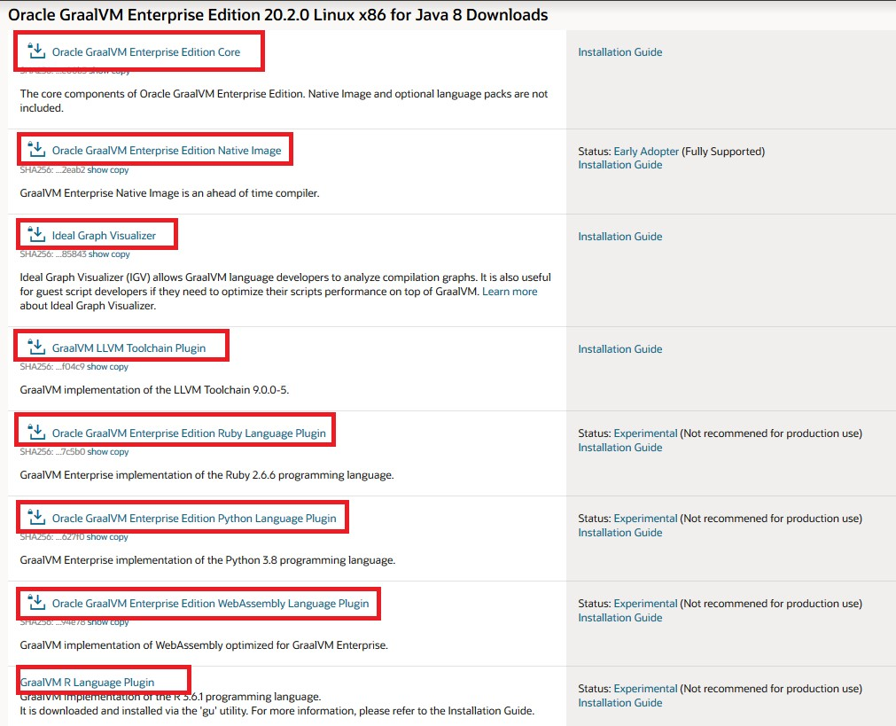

# GraalVM ハンズオン　Basic編
_Wednesday, 9 December 2020_

内容:

* **[Exercise 1: 前提環境／事前準備](#exercise-1-前提環境事前準備)**
* **[Exercise 2: GraalVM Enterpriseのインストール](#Exercise-2-GraalVM-Enterprise-Editionのインストール)**
   * [2.1: GraalVM EE20.1.0のCoreパッケージ](#21-GraalVM-EE2010のCoreパッケージ)
   * [2.2: Native Image, LLVM-toolchain, R言語コンポーネント](#22-Native-Image-LLVM-toolchain-R言語コンポーネント)
   * [2.3: Native Imageの依存ライブラリー](#23-Native-Imageの依存ライブラリー)

* **[Exercise 3: High-performance JIT コンパイラー](#Exercise-3-High-performance-JIT-コンパイラー)**
<br/>
<br/>

# Exercise 1: 前提環境／事前準備

本ワークショップを実施するための前提環境および事前準備作業を以下に記述します。Workshop当日は基本的に参加者に事前準備なされた環境のもとでハンズオン演習を実施して頂きます。

※ただし、ハンズオン演習部分を省きたい場合方は、GraalVMに関するプレゼンやDemoをご覧になりながら受講のみして頂くことも可能です。


  * 本ワークショップはLinux環境（WindowsマシーンのWSL環境を含む）を前提に進みます。（MacおよびWindows自体はGraalVMをサポートしますが、本ワークショップではUbuntu20.04の環境で実施、検証されたものです。
  * GitとCurlを事前にインストールしておいてください。
  * Githubリポジトリーからダウンロードすることがあるので、インターネットに繋がる状態が必要です。
  * 
<br/>

# Exercise 2: GraalVM Enterprise Editionのインストール

以下はGraalVM Enterprise Edition 20.1.0 for JDK 8をインストール手順となります。

# 2.1: GraalVM EE20.1.0のCoreパッケージ
(1) [OTN - Oracle Technology Network](https://www.oracle.com/downloads/graalvm-downloads.html)　からGraalVM Enterprise Editionをダウンロードします。下図のように"GraalVM Enterprise Edition 20 Current Release" タブを選択します。

  

(2)“Release Version 20.1.0, Java Version 8, Linux”を選択します。 MacOSを使用している場合macOSを選択してください。現時点でWindows版ではLinuxとMacOSに比べてGraalVMのフィーチャーが少ないので、本ワークショップではWindows版を選択しません。

  

(3)OSを選択後、以下３つのコンポーネントをダウンロードしてください。
1.	Oracle GraalVM Enterprise Edition Core
2.	Oracle GraalVM Enterprise Edition Native Image
3.	GraalVM LLVM Toolchain Plugin
また、本ワークショップでは上記３つのコンポーネント以外に、”GraalVM R Language Plugin” も必要になりますので、後にGraalVMのインストール・ユーティリティー(gu)を使用して該当コンポーネントをインストールします。

  
  本ワークショップでは使いませんが、オプションとして以下のコンポーネントも併せてインストールしてみてください：
1.	GraalVM Enterprise Edition Python Language Plugin
2.	Oracle GraalVM Enterprise Edition Ruby Language Plugin
3.	Oracle GraalVM Enterprise Edition WebAssembly Language Plugin
上記バイナリーをダウンロードするために、OTNにログインする必要があります。OTNアカウントをお持ちでない方は以下のログイン画面から作成してください。


  

モジュールをダウンロード後Linuxのファイルシステム上、下記のようにファイル一覧になります（赤線で囲まれている部分は本ワークショップで使うモジュールです）：
* graalvm-ee-java8-linux-amd64-20.1.0.tar.gz
* llvm-toolchain-installable-java8-linux-amd64-20.1.0.jar
*  native-image-installable-svm-svmee-java8-linux-amd64-20.1.0.jar
*  python-installable-svm-svmee-java8-linux-amd64-20.1.0.jar
*  namedruby-installable-svm-svmee-java8-linux-amd64-20.1.0.jar
* wasm-installable-svm-svmee-java8-linux-amd64-20.1.0.jar

 


(4)モジュールをダウンロード後、以下のように解凍します
  >```sh
  >tar -zxf graalvm-ee-java8-linux-amd64-20.1.0.tar.gz
  >```

上記コマンドの実行により”graalvm-ee-java8-20.1.0”というフォルダーが作成されます。
    


そのフォルダーをJava Homeとなる任意のディレクトリーに移動してください。下記の例では/optの配下に移動する例です：
  >```sh
  >sudo mv graalvm-ee-java8-20.1.0 /opt/.
  >```

これにより、GraalVMのインストールディレクトリーは/opt/graalvm-ee-java8-20.1.0になります。

(5)インストールしたGraalVMのパスを通すためには、以下のコマンドを実行します。

bashの場合
  >```sh
  >vi ~/.bashrc
  >```
zshの場合
  >```sh
  >vi ~/.zshrc
  >```


以下の行を ~/.zshrc もしくは ~/.bashrc に追加します。
  >```sh
  >export GRAALVM_HOME=/opt/graalvm-ee-java8-20.1.0
  >export PATH=$GRAALVM_HOME/bin:$PATH
  >export JAVA_HOME=$GRAALVM_HOME
  >```

ファイルを修正後、以下のコマンドで実行します。

bashの場合
  >```sh
  >source ~/.bashrc
  >```
zshの場合
  >```sh
  >source ~/.zshrc
  >```

以上でGraalVMのインストールが完了します。確認するため以下のjavaコマンドを実行します。
  >```sh
  >java –version
  >```

以下の出力結果を確認できれば、GraalVM 20.1.0 Java8が正常にインストールされたことになります。
  >```sh
  >Java(TM) SE Runtime Environment (build 1.8.0_251-b08)
  >Java HotSpot(TM) 64-Bit Server VM GraalVM EE 20.1.0 (build 25.251-b08-jvmci-20.1-b02, mixed mode)
  >```
<br/>

# 2.2: Native Image, LLVM-toolchain, R言語コンポーネント

(6)　最後の手順として、Native Image, LLVM toolchain, Rをインストールします。インストールするのにGraalVM Utility guを使用します。
  >```sh
  >gu install -L native-image-installable-svm-svmee-java8-darwin-amd64-20.1.0.jar
  >```

  >```sh
  >gu install -L llvm-toolchain-installable-java8-darwin-amd64-20.1.0.jar
  >```

  >```sh
  >gu install R
  >```
(※Rのインストール時、必要なモジュールを自動的にgithubよりダウンロードされます)]

インストール後、以下のguコマンドでインストールされたモジュールを確認します：
  >```sh
  >gu list
  >```


インストール完了後、以下のR言語ソースのコンフィグ作業も実施してください。
  >```sh
  >/opt/graalvm-ee-java8-20.1.0/jre/languages/R/bin/configure_fastr
  >```

以下の出力結果を確認します。

 
    The basic configuration of FastR was successfull.

    Note: if you intend to install R packages you may need additional dependencies.
    The following packages should cover depenedencies of the most commonly used R packages:
    On Debian based systems: apt-get install build-essential gfortran libxml2 libc++-dev
    On Oracle Linux: yum groupinstall 'Development Tools' && yum install gcc-gfortran

    Default personal library directory (/home/mluther/R/x86_64-pc-linux-gnu-library/fastr-20.1.0-3.6) does exist. Do you wish to create it? (Yy/Nn) y
    Creating personal library directory: /home/mluther/R/x86_64-pc-linux-gnu-library/fastr-20.1.0-3.6
    DONE

<br/>

# 2.3: Native Imageの依存ライブラリー

Native Imageの実行は、glibc-devel, zlib-devel, gccの三つのライブラリーが必要です。下記コマンドでインストールしてください。
  >```sh
  >sudo apt-get install build-essential libz-dev zlib1g-dev
  >```

おめでとうございます！以上の作業で本ワークショップに必要な環境設定がすべて完了しました。以下のタスクが実施されました：
1.	GraalVM EE20.1.0のCoreパッケージをインストールし、クラスパスを設定しました。
2.	Native Image, LLVM-toolchain, R言語の三つのコンポーネントをインストールしました。
3.	Rのコンフィグを実施しました。
4. Native Imageに必要なライブラリーをインストールしました.  
<br/>

# Exercise 3: High-performance JIT コンパイラー

以下の演習は「Top 10 Things To Do With GraalVM」 の内容を使用します。  
https://medium.com/graalvm/graalvm-ten-things-12d9111f307d

(1)上記内容を使用するため、Githubよりソースをダウンロードします。以下のコマンドを実行します。

  >```sh
  >git clone https://github.com/marthenlt/native-image-workshop.git
  >```

(2)ダウンロードしたディレクトリーに移動します。

  >```sh
  >cd graalvm-ten-things
  >```

(3)以下のコマンドを実行し、large.txtファイルを作成します。この作業は時間がかかります。

  >```sh
  >make large.txt
  >```

(4)large.txtファイルが作成されたことをlsコマンドで確認します。サイズが150MBであることを確認してください。


(5)TopTen.javaはlarge.txtの中から単語を集計し、上位トップテンの単語一覧を出力するJavaプログラムです。このプログラムはStream Java APIを使用し、すべての単語をソート、カウントします。 

以下はプログラムの内容です。
```java
import java.io.IOException;
import java.nio.file.Files;
import java.nio.file.Paths;
import java.util.Arrays;
import java.util.function.Function;
import java.util.stream.Collectors;
import java.util.stream.Stream;

public class TopTen {

    public static void main(String[] args) {
        Arrays.stream(args)
                .flatMap(TopTen::fileLines)
                .flatMap(line -> Arrays.stream(line.split("\\b")))
                .map(word -> word.replaceAll("[^a-zA-Z]", ""))
                .filter(word -> word.length() > 0)
                .map(word -> word.toLowerCase())
                .collect(Collectors.groupingBy(Function.identity(), Collectors.counting()))
                .entrySet().stream()
                .sorted((a, b) -> -a.getValue().compareTo(b.getValue()))
                .limit(10)
                .forEach(e -> System.out.format("%s = %d%n", e.getKey(), e.getValue()));
    }

    private static Stream<String> fileLines(String path) {
        try {
            return Files.lines(Paths.get(path));
        } catch (IOException e) {
            throw new RuntimeException(e);
        }
    }

}
```

(6)TopTen.javaをコンパイラーします。デフォルトではGraalVMのJavaコンパイラーが有効で、使用されます。

  >```sh
  >javac TopTen.java
  >```

(7)GraalVMのJITコンパイラーによりコンパイルされたJavaクラスを実行し、実行タイムを測ります。引数にはlarge.txtを指定します。

  >```sh
  >time java TopTen large.txt
  >```

実行結果と実行時間を確認します。

```
sed = 502500
ut = 392500
in = 377500
et = 352500
id = 317500
eu = 317500
eget = 302500
vel = 300000
a = 287500
sit = 282500

real    0m34.884s
user    0m35.828s
sys     0m3.625s
```